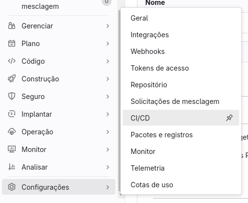
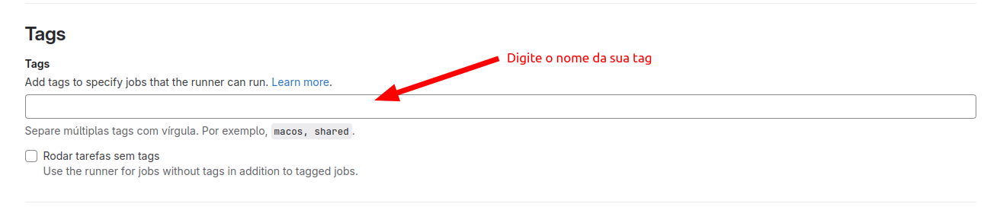
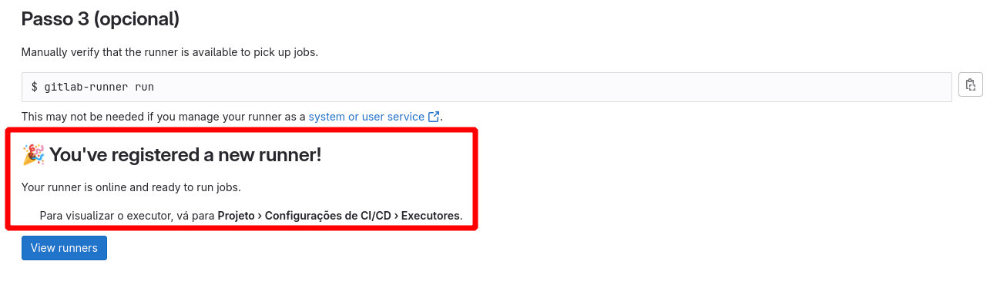

# Passo a passo para configuração do Runner pelo site `Gitlab.com`

- [ ] 1️⃣ Entrar no repositorio em que deseja criar o Runner, vá até **Configurações**>**CI/CD**>**Runner/Executores**>. E clique em `Novo executor do projeto`.

  

- [ ] 2️⃣ - Digite um nome para a tags do seu runner, pode ser apenas uma.

  

- [ ] 3️⃣ - registrar o git lab-runner com o seguinte commando:

```
gitlab-runner register  --url https://gitlab.com  --token glrt-srioeFkA_B2FwW_Tw7k2
```

- [ ] 4️⃣ - Executar o Runner com o seguinte commando:

```
gitlab-runner run
```

- [ ] 5️⃣ - Se vc executou tudo corretamente, deverá aparecer essa mensagem:

 

- [ ] 6️⃣ - Clique em **View Runners**

> **Pronto o processo está concluido 👏🏻 👏🏻 👏🏻.**

# Passo a passo para configuração do Runner localmente.

- [ ] 1️⃣ - registrar o git lab-runner com o seguinte commando:

# Passo a passo para configuração do Runner localmente.

- [ ] 1️⃣ Ingressar o Runner em modo shell no Gitlab

```bash
sudo gitlab-runner register -n \
  --url http://IP-OU-URL \
  --registration-token TOKEN \
  --executor shell \
  --description "Runner Shell"
```

- [ ] 2️⃣ - Criar o container gitlab-runner para o Docker
> **OBS:** Se estiver utilizando gitlab.com ou certificado, altere para HTTPS://

```bash
docker run -dit \
  --name runner-docker \
  --restart always \
  -v /var/run/docker.sock:/var/run/docker.sock \
  -v /opt/gitlab-runner/config:/etc/gitlab-runner \
  gitlab/gitlab-runner:ubuntu-v14.9.1
```

- [ ] 3️⃣ - Ingressar o Runner em modo docker no GitLab.
> **OBS:** Se estiver utilizando gitlab.com ou certificado, altere para HTTPS://

```bash
docker exec -it runner-docker \
gitlab-runner register -n \
  --url https://IP-OU-URL \
  --url http://IP-OU-URL \
  --registration-token TOKEN \
  --clone-url http://IP-OU-URL\
  --executor docker \
  --docker-image "docker:latest" \
  --docker-privileged
```
