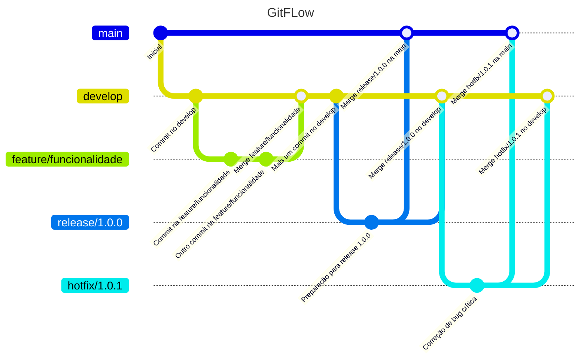

# Gitflow e versionamento semantico

## Master

#### Descrição:
Esta branch é a mais importante, reflete nosso codigo produtivo

- **Tipo:** Principal
- **Tempo de vida:** infinito
- **Criada de:** N/A
- **Pode ir para:**develop

## Develop

#### Descrição:
Contém os codigos da proxima release. quando a branch develop estiver pronta para entrar em produção, um "merge" pode ser feito para a branch master.

- **Tipo:** Principal
- **Tempo de vida:** infinito
- **Criada de:** master(Uma única vez)
- **Pode ir para:** Master

## Feature

#### Descrição:
Criada para desenvolver uma nova funcionalidade, ela só deverá existir nesse espeço de tempo. Uma feature branch pode tambem ter seu desenvolvimento cancelado por N motivos.

- **Tipo:** Suporte
- **Tempo de vida:** infinito
- **Criada de:** Develop
- **Pode ir para:** Develop

## Release

#### Descrição:
Auxilia a preparação de uma nova versão de produção e permite correçoes de bugs menores e a preparação de metadadod de uma versão

- **Tipo:** Suporte
- **Tempo de vida:** finito
- **Criada de:** Develop
- **Pode ir para:** Develop & Master

## Hotfix

#### Descrição:
As Hotfix surgem da necessidade de agir imediatamente sobre uma situação indesejada na versão de produção ativa. Pode ser cirado a partir da branch maste que indica a versão em produção.

- **Tipo:** Suporte
- **Tempo de vida:** finito
- **Criada de:** Master
- **Pode ir para:** Master $ Develop

## Tag

#### Descrição:
Demarca um ponto(commit) na master que representa uma versão efetiva para produção.

- **Tipo:** Principal
- **Tempo de vida:** infinito
- **Criada de:** Master

## Fluxograma

# Versionamento Semantico

O versionamento sêmantico apresenta algo simples (não simplorio) e objetivo para enumara a versão do cogido.

### POR EXEMPLO `1 . 12 . 7`

- 🚀 **1(Primeiro casa)** - Major, é a imcompatibilidade, ou seja as quebras de versões.

- 📉 **12(Segunda casa)** - Minor, são as novas funcionalidades da sua major

- 🕷️ **7(terceira casa)** - Patch, correções de bugs das major e minor.
