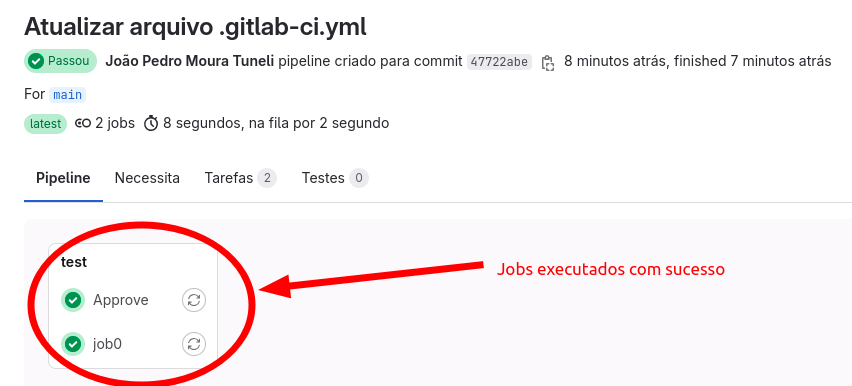

# Executando a primeira pipeline

A cada commit feito uma pipeline é inicializada, pois ainda não atribuimos nenhuma regra de inicialização das pipelines

## Passo a passo para executar sua primeira pipeline:

- [ ] 1️⃣ Crie o arquivo `gitlab-ci.yml` no repositorio que vc vai rodar sua pipeline

- [ ] 2️⃣ Configurar no `gitlab-ci.yml` as tags do Runner que vc tem disponivel:
```yaml
job0:
  tags:
      - meulinux #TAGS dos Runners disponiveis
  script:
      - echo "Olá mundo!!!"
Approve:
  tags:
      - shell #TAGS dos Runners disponiveis
  script:
      - echo "Aprovado com sucesso!"
```

- [ ] 3️⃣ faça o commit para rodar a pipeline, se vc fez todos os passos desse passo a passo, vc verá essa tela:

    
git add 