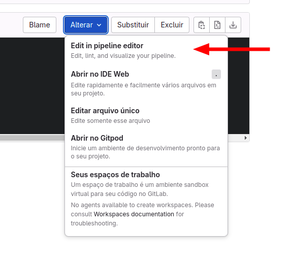

# Criando job WHEN manualmente.

- [ ] 1️⃣ Abra o arquivo do `gitlab-ci.yml` e escolha a opção **Edite em pipeline editor**:

    

- [ ] 2️⃣ Configure no arquivo `gitlab-ci.yml`, dentro do job1 , iremos colocar os steps de tags, sinalizando o runner que será executado, a tag script, com o comando que será utilizado, e tambem o step `WHEN` que adiona uma etapa manual no job1.

    ```yaml
    job1:
      when: manual
      tags:
        - "shell"
      script:
        - echo "Executa somente manual"
    ```

- [ ] 3️⃣ faça o commit para rodar a pipeline, se vc fez todos os passos desse passo a passo, vc verá essa tela:
