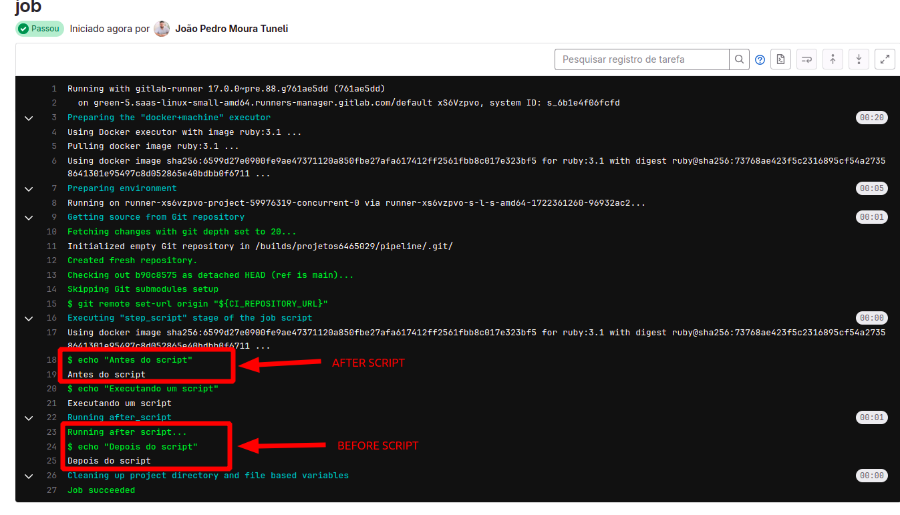

# Condições dos scripts `after_script`, `before_script`

- `after_script` - Ele substitui um conjunto de comandos que são executados após um script ser finalizado

- `before_script` - Ele substitui um conjunto de comandos que são executados antes do trabalho

Como por exemplo no yaml abaixo:
```yaml
before_script:
  - echo "Antes do script"
after_script:
  - echo "Depois do script"

job:
  script:
    - echo "Executando um script"
```



Mais tambem temos diversos atributos de scripts diferentes, como por exemplo:

- `allow_failure` - Permite que o script falhe, um script com falha não faz com que a pipeline falhe

- `artifacts` - Lista os arquivos e diretorios para anexar a um trabalho em caso de sucesso

- `cache` - Lista de arquivos que devem ser armazenados em cache entre execuções subsequentes.

- `coverage` - Codifique as configurações de cobertura para um deterinado script

- `dast-configuration` -2 Use a configuração dos perfis do DAST em um nível de trabalho.

- `dependencies` Restrinja quais artefatos são passados para um trabalho especifico fornecendo uma lista de trabalhos dos quais buscar artefatos.