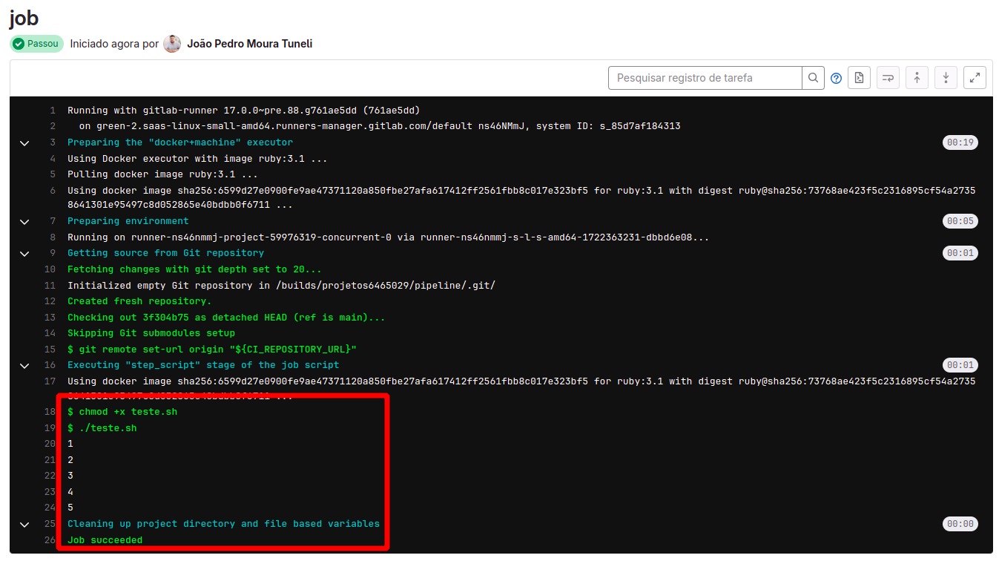

# Scripts com mais de uma linha

Ate o momento estamos executando somento comandos de uma unica linha como o `echo "uma mensagem"`, mais caso for preciso executar um script com mais de uma linha como fazemos?

Digamos que vamos executar uma lista de 1 a 5:

```bash
#!/bin/bash

i=0
while [ $i -ne 5 ]
  do
    i=$(($i+1))
    echo "$i"
done

```

vamos precisar criar um arquivo `.sh` com esse conteudo e chamar esse "script" da pipeline da seguinte forma
```yaml
job:
  script:
    - chmod +x teste.sh
    - ./teste.sh
```

Primeiro iremos dar permissão de executação para o script e depois chamamos sua execução. e esse é o resultado final:



## OU

Podemos utilizar o `|` na arquivo yaml para dar mais de um comando:

```yaml
job:
  script:
    - | 
       i=0
       while [ $i -ne 5 ]
         do
          i=$(($i+1))
          echo "$i"
       done
```